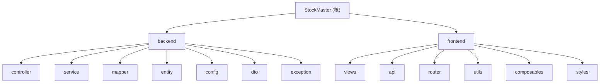

# StockMaster - 库存管家

## 变更记录 (Changelog)

| 时间 | 操作 | 说明 |
|------|------|------|
| 2026-03-20T17:34:57 | 初始化 | 首次生成项目文档 |

## 项目愿景

StockMaster（库存管家）是一个前后端分离的库存管理系统，用于管理设备类和耗材类货物的入库、出库及库存追踪。支持多角色权限控制、数据导出（Excel）、结算状态管理等功能。

## 架构总览

- **架构模式**: 前后端分离（SPA + REST API）
- **后端**: Spring Boot 2.3.12 + MyBatis Plus 3.4.3 + MySQL + JWT + Spring Security
- **前端**: Vue 3.3 + Vue Router 4 + Element Plus 2.3 + Axios + Vite 4
- **认证**: JWT Token（24小时过期），拦截器校验
- **权限**: 基于角色的权限控制（RBAC），权限存储为 JSON 字符串
- **数据库**: MySQL，数据库名 `stock_master`
- **导出**: EasyExcel 3.1.1，支持货物/入库/出库记录导出为 xlsx

## 模块结构图



## 模块索引

| 模块 | 路径 | 语言 | 职责 |
|------|------|------|------|
| backend | `backend/` | Java 8 | Spring Boot REST API 服务，提供业务逻辑、数据持久化、认证鉴权 |
| frontend | `frontend/` | JavaScript (Vue 3) | SPA 前端，提供用户界面、路由守卫、API 调用 |

## 运行与开发

### 后端

```bash
# 开发环境（使用 application-dev.yml）
cd backend
# 修改 application.yml 中 spring.profiles.active 为 dev
mvn spring-boot:run

# 打包
mvn clean package
```

- 端口: `9555`
- 数据库: `jdbc:mysql://localhost:3306/stock_master`
- dev 环境默认账号: `root/root`
- prod 环境账号: `stock_master/nrDDPeNcadd8yka7`

### 前端

```bash
cd frontend
npm install
npm run dev      # 开发服务器，端口 3000
npm run build    # 构建到 frontend/dist/
npm run preview  # 预览构建产物
```

- 开发代理: `/api` -> `http://localhost:9555`（rewrite 去掉 `/api` 前缀）

### 部署

- 前端通过 nginx 反向代理（参考 git 提交记录 `bb6754d`）
- 后端以 jar 包运行

## 数据模型

### 数据库表

| 表名 | 实体类 | 说明 |
|------|--------|------|
| `goods` | `Goods` | 货物信息（名称、品牌、型号、批次、单价、库存） |
| `inbound_record` | `InboundRecord` | 入库记录（关联货物、数量、入库人、结算状态） |
| `outbound_record` | `OutboundRecord` | 出库记录（关联货物、数量、使用部门、出库人） |
| `sys_user` | `User` | 系统用户（用户名、密码BCrypt、角色关联、状态） |
| `sys_role` | `Role` | 系统角色（角色名、权限JSON） |

### 货物类型

- `device` - 设备类
- `consumable` - 耗材类

### 权限列表

权限存储在 `sys_role.permissions` 字段，JSON 数组格式：
- `goods` - 货物管理
- `inbound` - 入库记录
- `outbound` - 出库记录
- `user` - 用户管理
- `role` - 角色管理

## 测试策略

- **当前状态**: 无测试代码。`pom.xml` 包含 `spring-boot-starter-test` 依赖但未编写测试。
- **建议**: 优先为核心业务逻辑（库存更新、入出库事务）添加单元测试。

## 编码规范

- 后端使用 Lombok 简化 POJO
- MyBatis Plus 注解式 Mapper + LambdaQueryWrapper
- 统一响应体 `Result<T>`（code/message/data）
- 全局异常处理（`GlobalExceptionHandler`）
- 前端使用 Vue 3 `<script setup>` 语法
- API 模块化拆分（`api/goods.js`, `api/inbound.js` 等）
- 可复用逻辑封装为 composables（`useExport`, `usePagination`）

## AI 使用指引

- 修改业务逻辑时注意入库/出库的事务性：库存更新与记录保存在同一事务中
- 库存更新使用乐观锁（CAS 重试 3 次）
- 出库员角色看不到货物单价（`GoodsDTO` 过滤）
- 前端路由中 `meta.type` 区分设备类/耗材类，同一组件复用
- JWT 密钥硬编码在 `JwtUtils` 中（生产环境应迁移到配置文件或密钥管理服务）
